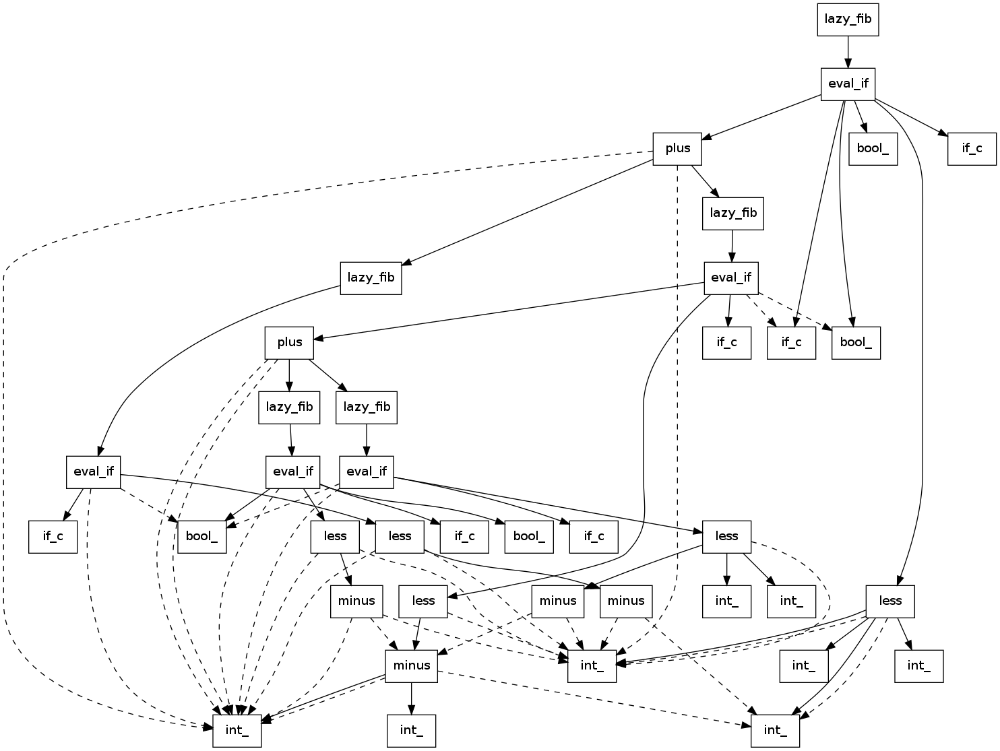

# Utilities for templight

Here you can find scripts for getting information from an XML trace
generated by [Templight](http://plc.inf.elte.hu/templight):

* `instantiated_templates` prints the list of templates that were instantiated.
  Every template goes into its own line. You can use tools like `grep` or `wc`
  to get further information.
* `instantiation_diagram` generates a [Grapviz](http://www.graphviz.org/)
  diagram of the templates that were instantiated.

## Example

In the `sample` directory you can find an example source code, the XML trace
file and the generated output.

The generated diagram:



The list of templates that were instantiated:

```cpp
bool_<false>
bool_<false>
bool_<false>::value
bool_<true>
bool_<true>
bool_<true>
bool_<true>::value
eval_if<less<int_<3>, int_<2> >, int_<1>, plus<lazy_fib<minus<int_<3>, int_<1> > >, lazy_fib<minus<int_<3>, int_<2> > > > >
eval_if<less<minus<int_<3>, int_<1> >, int_<2> >, int_<1>, plus<lazy_fib<minus<minus<int_<3>, int_<1> >, int_<1> > >, lazy_fib<minus<minus<int_<3>, int_<1> >, int_<2> > > > >
eval_if<less<minus<int_<3>, int_<2> >, int_<2> >, int_<1>, plus<lazy_fib<minus<minus<int_<3>, int_<2> >, int_<1> > >, lazy_fib<minus<minus<int_<3>, int_<2> >, int_<2> > > > >
eval_if<less<minus<minus<int_<3>, int_<1> >, int_<1> >, int_<2> >, int_<1>, plus<lazy_fib<minus<minus<minus<int_<3>, int_<1> >, int_<1> >, int_<1> > >, lazy_fib<minus<minus<minus<int_<3>, int_<1> >, int_<1> >, int_<2> > > > >
eval_if<less<minus<minus<int_<3>, int_<1> >, int_<2> >, int_<2> >, int_<1>, plus<lazy_fib<minus<minus<minus<int_<3>, int_<1> >, int_<2> >, int_<1> > >, lazy_fib<minus<minus<minus<int_<3>, int_<1> >, int_<2> >, int_<2> > > > >
if_c<false, int_<1>, plus<lazy_fib<minus<int_<3>, int_<1> > >, lazy_fib<minus<int_<3>, int_<2> > > > >
if_c<false, int_<1>, plus<lazy_fib<minus<minus<int_<3>, int_<1> >, int_<1> > >, lazy_fib<minus<minus<int_<3>, int_<1> >, int_<2> > > > >
if_c<false, type-parameter-0-0, type-parameter-0-1>
if_c<false, type-parameter-0-0, type-parameter-0-1>
if_c<true, int_<1>, plus<lazy_fib<minus<minus<int_<3>, int_<2> >, int_<1> > >, lazy_fib<minus<minus<int_<3>, int_<2> >, int_<2> > > > >
if_c<true, int_<1>, plus<lazy_fib<minus<minus<minus<int_<3>, int_<1> >, int_<1> >, int_<1> > >, lazy_fib<minus<minus<minus<int_<3>, int_<1> >, int_<1> >, int_<2> > > > >
if_c<true, int_<1>, plus<lazy_fib<minus<minus<minus<int_<3>, int_<1> >, int_<2> >, int_<1> > >, lazy_fib<minus<minus<minus<int_<3>, int_<1> >, int_<2> >, int_<2> > > > >
int_<0>
int_<0>::value
int_<1>
int_<1>
int_<1>
int_<1>
int_<1>
int_<1>
int_<1>
int_<1>
int_<1>
int_<1>
int_<1>
int_<1>::value
int_<2>
int_<2>
int_<2>
int_<2>
int_<2>
int_<2>
int_<2>
int_<2>
int_<2>
int_<2>
int_<2>::value
int_<3>
int_<3>
int_<3>
int_<3>
int_<3>
int_<3>::value
lazy_fib<int_<3> >
lazy_fib<minus<int_<3>, int_<1> > >
lazy_fib<minus<int_<3>, int_<2> > >
lazy_fib<minus<minus<int_<3>, int_<1> >, int_<1> > >
lazy_fib<minus<minus<int_<3>, int_<1> >, int_<2> > >
less<int_<3>, int_<2> >
less<minus<int_<3>, int_<1> >, int_<2> >
less<minus<int_<3>, int_<2> >, int_<2> >
less<minus<minus<int_<3>, int_<1> >, int_<1> >, int_<2> >
less<minus<minus<int_<3>, int_<1> >, int_<2> >, int_<2> >
minus<int_<3>, int_<1> >
minus<int_<3>, int_<1> >
minus<int_<3>, int_<1> >
minus<int_<3>, int_<2> >
minus<minus<int_<3>, int_<1> >, int_<1> >
minus<minus<int_<3>, int_<1> >, int_<2> >
plus<lazy_fib<minus<int_<3>, int_<1> > >, lazy_fib<minus<int_<3>, int_<2> > > >
plus<lazy_fib<minus<minus<int_<3>, int_<1> >, int_<1> > >, lazy_fib<minus<minus<int_<3>, int_<1> >, int_<2> > > >
```
  
## License

The tools are published under the
[GNU General Public License, version 3](http://www.gnu.org/licenses/gpl.html).


